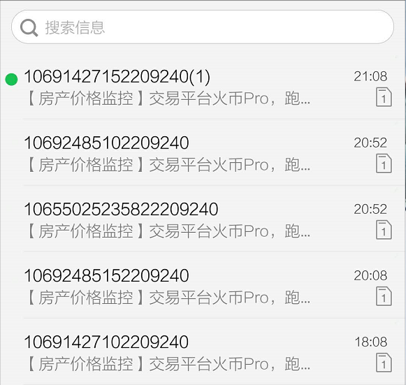

# 数字货币价格监控

该程序通过实时监控各大平台货币价格，然后根据用户感兴趣的价格，超过阈值后
通过短信来提醒用户。

## 支持的平台

支持各个主流平台和嵌入式平台，无需编译，携带方便。

- mac osx
- window
- linux
- intel edison
- raspberry pi

## 短信服务

短信服务使用的是阿里云的短信服务，0.045 CNY/条

## 数据服务

数据服务使用的非小号的数据

## 配置文件

``` yaml

## feixiaohao
## https://www.feixiaohao.com 注册账号密码， 并添加货币自选
userid:
passwd:

## aliyun config
## 阿里云 短信网关配置
accesskey:
accessid:
signname:
templatecode:

## user config
## 用户币价监控配置

# 提醒电话号码
notifyphone:

# 提醒周期3600秒为一个小时
notifytimeperiod:

# 币价浮动下线
lowpricepercent: -2.0

# 币价浮动上线关注点
highpricepercent: 3.0

# 货币列表
cointype:
 - BTC
 - ETH

```

## 程序运行截图



## 程序获取

程序源码获取和使用，只能通过捐赠来获取，最少捐赠数额： 9.9 CNY

- 应用程序
- 支持部分简单定制

支持的方式:

- [支付宝](./screens/alipay.png)
- [微信](./screens/wechatpay.png)
- BTC [ 1EJvuSMB9vd1yFRtv1oPAyHB5d5F2b4GWL ]
- CMT [ 0xee62f2f97d3320e8581e01bc241791da93a64486 ]

## 联系方式

微信：

