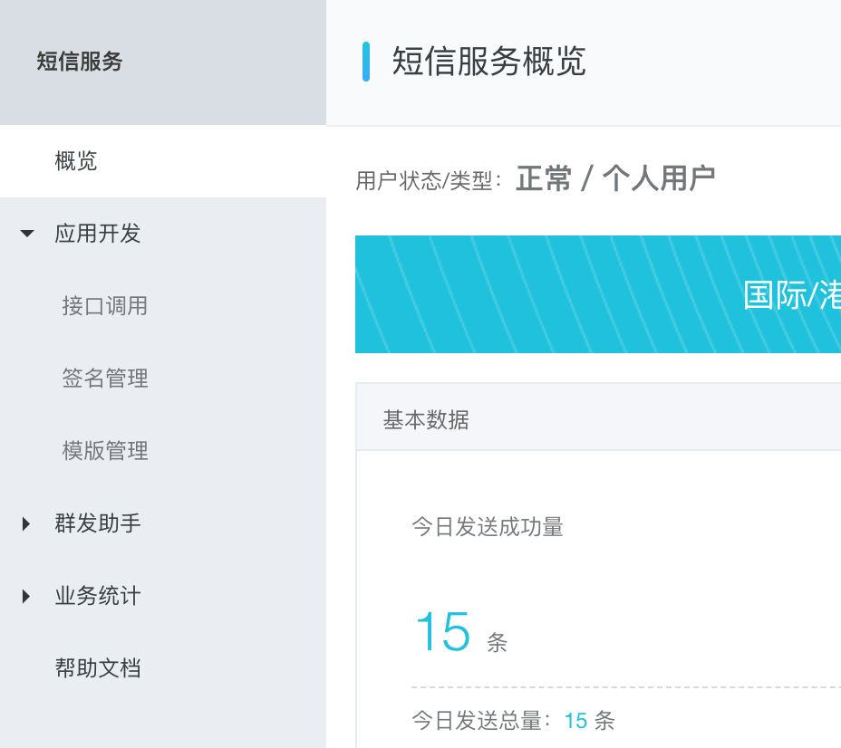
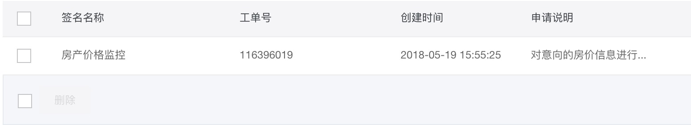
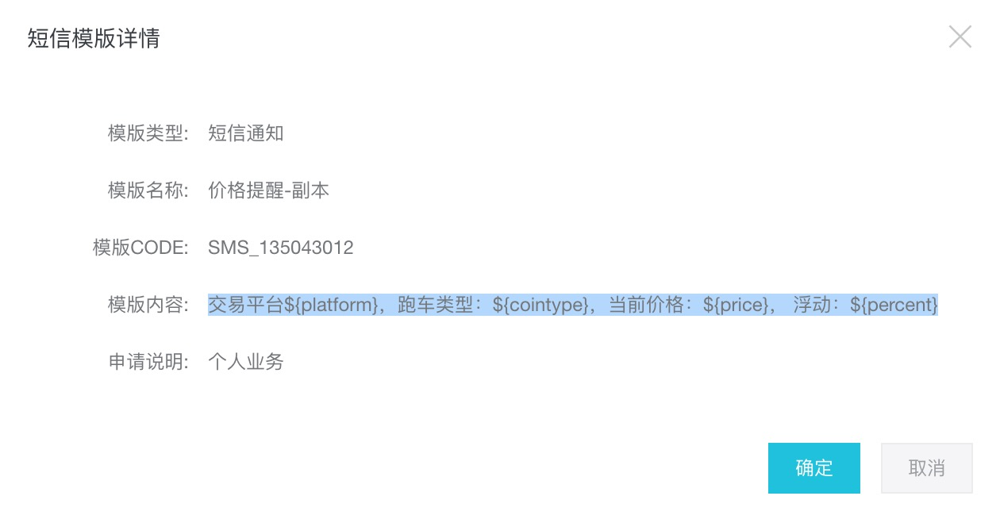

# 阿里云短信服务开通使用

阿里云的云通信里面提供了短信的服务，具体到个人需要自己去开通服务，开通服务是免费的，
但是发送是要收费的。

具体的费用一般是 0.045 CNY / 条。

## 页面简介



### 接口调用

接口调用部分提供了很多各个语言的 API 和 SDK 版本工具。另外可以申请创建`AccessKey` 和 `AccessID`。

### 签名管理

签名管理是指短信开头的那个提示内容，一般是指某个企业或者个人的抬头。

这个需要根据要求填写并申请。

范例：



### 模板管理

短信模板管理，是指发送短信的正文模板，注意正文中同样不能出现铭感的文字：

范例：

``` shell
交易平台${platform}，跑车类型：${cointype}，当前价格：${price}， 浮动：${percent}
```

注意中间的 `${}` 变量等不要改变，只需要该改中文的字体即可。



## 参数说明

提醒服务配置中关于短信的配置：

``` shell
## aliyun config
## 阿里云 短信网关配置

accesskey:
accessid:

signname:
templatecode:
```

其中 `AccessKey` 和 `AccessID` 的话，只需要在短息开通的时候在接口就按照提示申请即可。 `signname` 就是申请的签名，是中文字符串，而`templatecode`就是短信模板的Code。